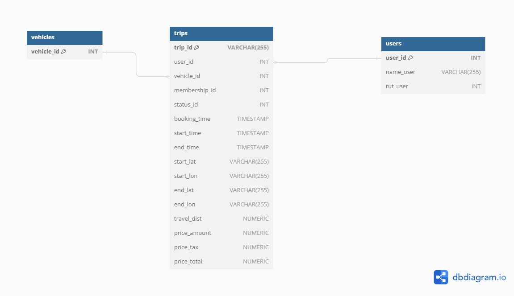

P.1:
    Diseñar un modelo de datos. Genere una propuesta sobre cómo guardar los datos. Justifique esa propuesta y explique por qué es la mejor opción.

R.1:
    Para esta base de datos realicé un modelo de estrella, con la fact table que contiene la información de trips, y 2 dimension table para almacenar users y vehicles.
    

    Elegí este modelo ya que para el caso presentado al no tener información respecto a requerimientos de seguridad o recursos permite una arquitectura más facil de comprender al no estar tan disgregada y sigue poniendo enfasís en los viajes realizados que viene a ser complementada por las tablas de dimensiones con el objetivo de no repetir información.

    De todas formas si existieran requisitos especificos de privacidad de los datos o solicitudes del cliente interno especificas dejo también una arquitectura con más tablas aun que se trabajara en base al primer esquema señalado.
    

P.3
    Crea las tablas del modelo de datos que diseñaste en el paso 1. Puede usar scripts SQL o código en Python.

R.3
    Se realizó a través de modelo_datos.py donde se realiza la conexión a la base de datos en postgres
    creando las tablas necesarias para el modelo si es que estas no existen

P.4
    Genera archivos en Python para cargar los datos del archivo trips.csv en las tablas que creaste en el paso anterior.

R.4
    Se realizó a través de carga_datos.py donde utilizando pandas se proceso el archivo csv entregado creando dataframes
    especificos según la tabla necesaria. Estos posteriormente son cargados utilizando la función de pandas especifica junto con la la conexión
    a través de sqlalchemy al postgres.

P.5 
    Cree una nueva tabla en Postgres llamada resumen_diario.
    
    i) Genera con Python un proceso de ETL que cargue en la tabla un resumen por día de:
        la cantidad de viajes
        los suma de ingresos
        el promedio de ingresos
        la suma de metros recorridos. Explique y justifique las decisiones que tomó para generar el resumen. Considere que diariamente no habrá más de 100.000 viajes.
    ii) Señale (sin necesidad de implementar) qué procesos podría desarrollar para asegurar la consistencia de los datos en la tabla resumen_diario.
    iii) Señale (sin necesidad de implementar) cómo podría automatizar este proceso de ETL de manera diaria.

R.5
    i) Se realizó a través de carga_datos.py donde se agruparon de forma diaria los valores y se realizaron los cálculos requeridos. Posteriormente se renombro la columna
    a dia y se creo una columna de id. Después se realizo la carga a las tablas utilizando la función de pandas especifica junto con la la conexión a través de 
    sqlalchemy al postgres.

    ii) En primer lugar revisar que los datos no se encuentren dúplicados, y haría restricciones para verificar que los datos ingresados tengan el formato correspondiente. Un ejemplo de esto sería tambien revisar que el price_tax se calcula correctamente y corresponde al 19% del price_amount y verificaria que price_total sea correcto.
    Otro punto relevante es que crearia un código para almacenar los valores rechazados en otra tabla para así poder análisis del por que ha ocurrido esto.

    iii) Utilizaría herramientas especificas como airflow ya que al tener clock y trigger por eventos me permite asignar una frecuencia para ejecutar la query la cual en este caso sería diaria.

P.6
    La empresa quiere implementar un sistema de descuentos mediante cupones. ¿Cómo modificarías el modelo de datos para agregarlo? Describa su propuesta, justifique y explique por qué es la mejor opción. No es necesario que lo implemente.

R.6
    En caso de implementar el sistema de descuento a través de cupones crearia una nueva tabla de dimensión para los pagos llamada payments, sacando de trips price_amount, price_tax y price_total. En la nueva tabla payments agregaria las columnas price_amount_before_cupon, price_tax_before_cupon, cupon_amount y con eso pondria 3 columnas más las cuales serían price_amount_after_cupon, price_tax_after_cupon y price_total.

    Esta sería la mejor forma ya que al agregar un cupón este se encuentra mayormente relacionando con el pago, permite crear una nueva tabla más relacionada a la parte financiera del negocio, capturando más datos como el viaje antes de los descuentos y después de los descuentos, además de más información que pudiera ser relevante con respecto a esta área. A su vez al momento de generar reporteria a un área financiera se podría consultar solamente esta tabla trayendo la información pertinente. 
    
    Se debe entender que la arquitectura está basada en la información del caso, ya que por ejemplo si el área de finanzas requiriera no solo esta información del pago si no que también de los vehiculos utilizados por un tema del costo de estos, e incluso la distancia recorrida por temas de vida util, y varios casos más donde toda información disgregada se tenga que volver a unir esto repecutiria en la arquitectura planteada. 